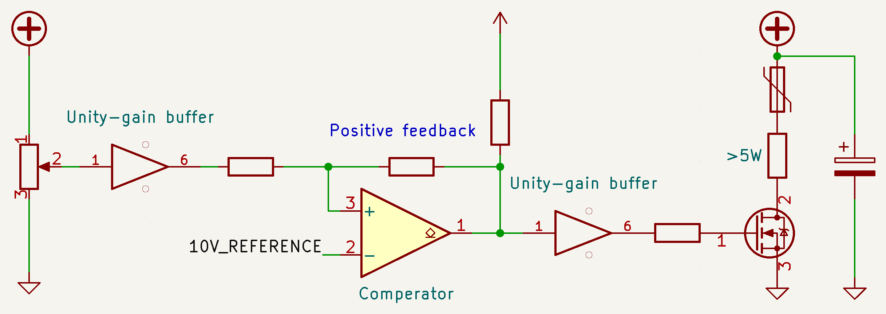
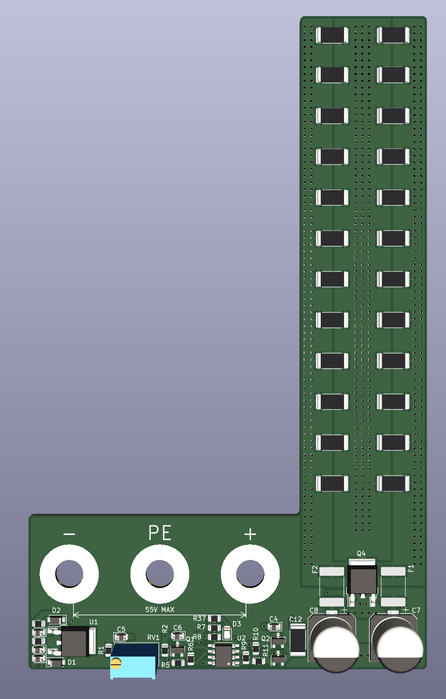
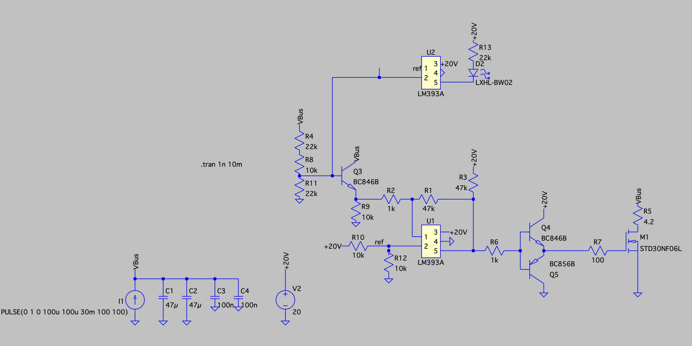
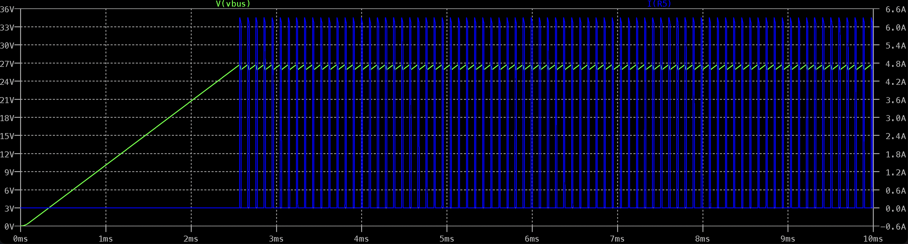
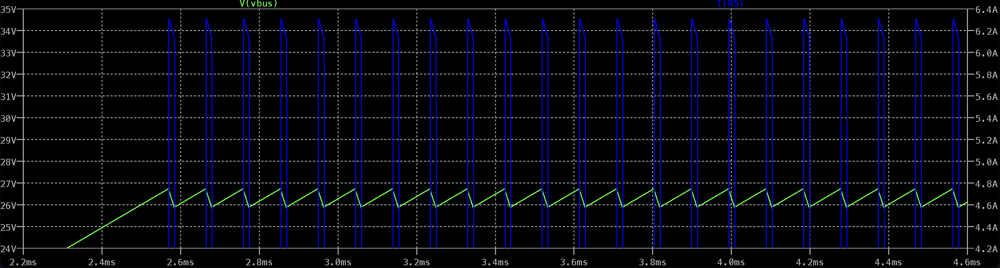

# Low cost shunt regulator
This repository contains the design of a shunt regulator that's designed to be easy to manufacture and mount onto the front of my power supply. This readme will briefly describe the design and it's properties.

## Rationale
Most low-cost (lab/bench) power supplies are only able to supply power, they are not able to sink it. This becomes a problem when powering motor controllers, where the energy generated by "braking" cannot be dissipated elsewhere. I'd like to connect a motor controller to my power supply, as far as I know, there wasn't a cheap/simple solution that would allow me to do that safely. So I decided to try to develop my own solution.

## Requirements
 - Mount right on the binding-posts of my power supply
 - Inherently safe, no chance of burning my house down!
 - Voltage range: 24V - 55V
 - Peak current dissipation: >5A
 - Continuous power dissipation: >5W, for example: 
   - Brake a 1000 gcm^2 rotor, from 3.000 rpm to 0 rpm every second.
   - Brake a 33 gcm^2 rotor from 16.000 rpm to 0 rpm every second.
 - I'd like to use as many "jellybean" components as possible, to keep the cost down and to enable cheap manufacturing services.
 

## Design
The global design can be summarized by a comperator, a MOSFET, a polyfuse and some resistors. The picture below illustrates the circuit.

The idea is that the comperator simply enables the MOSFET when the bus voltage is higher than a set limit. There is some positive feedback for a bit of hysteresis: To prevent fast fluttering of the MOSFET. The voltage bus has significant capacitance, so the voltage doesn't instantly drop to 0, it "depletes" the capacitors until the voltage level is acceptable again.

The picture below shows the PCB design, it's shaped to fit around my power supply (Owon SPE-series).

## Simulation
An LTSpice simulation is made to validate the design before prototyping. A constant-current source simulates the regenerative braking of a motor. 

The behaviour is as expected, the voltage is constrained, it looks like a saw-tooth or triangular wave depending on the brake current. The image below shows the bus voltage in green and the current through the resistors in blue.

The image below shows a zoomed-in view.

## Experiments
TODO